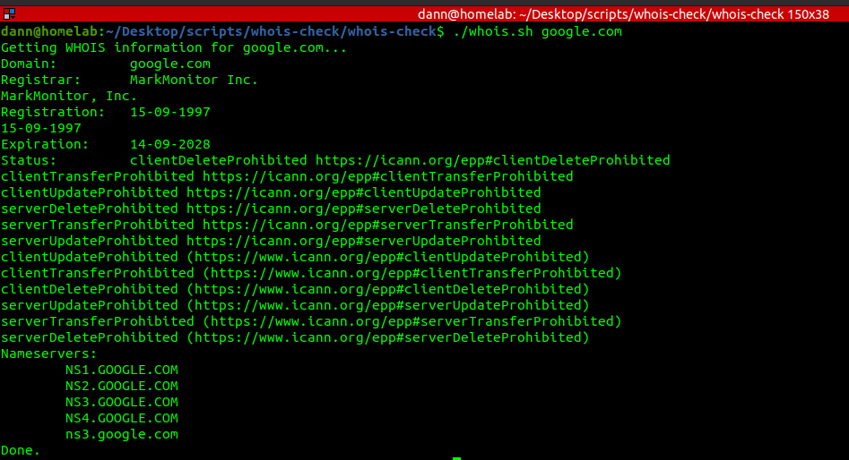

# A simple whois check bash script for Domain Names 

The script uses the whois unix command to get a domain Whois details. 

Using the *whois* command provides too many details which can be confusing. 

The script just displays the common details we look for such as Registrar, Expiry date, Status and Nameservers. 

## To install. 

Run 

1. Clone the url

```git clone https://github.com/dannydev77/whois-check.git .```

2. Change the script permissions to execute as the current user.

```chmod u+x```

3. Run the script passing the domain name as the argument.

```./whois.sh google.com ```

## Sample 

  
